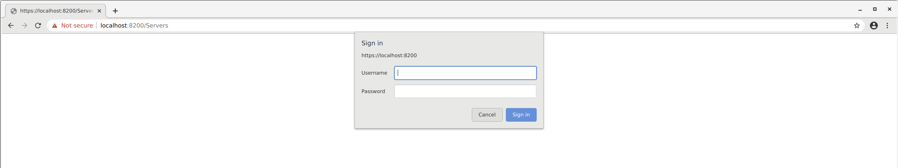

# Sadmin

[](http://travis-ci.org/mramshaw/Sadmin)
[](http://codecov.io/github/mramshaw/Sadmin?branch=master)
[](http://goreportcard.com/report/github.com/mramshaw/Sadmin)
[](http://godoc.org/github.com/mramshaw/Sadmin)
[](http://github.com/mramshaw/Sadmin/releases)

This is an application to securely manage co-located servers.


1. The administrative interface is accessed via HTTPS. 

2. The administrative interface communicates with an API via REST.

3. The API in turn communicates with a database.

Security is a requirement for each of these communications.

## Contents

The contents are as follows:

* [Requirements](#requirements)
    * [Operating system](#operating-system)
    * [Golang](#golang)
    * [Docker](#docker)
    * [Docker-Compose](#docker-compose)
* [Design](#design)
    * [Database](#database)
    * [Deployment](#deployment)
    * [Logging](#logging)
    * [Database replication](#database-replication)
    * [Database backup & recovery](#database-backup--recovery)
    * [Traffic shaping & firewalls](#traffic-shaping--firewalls)
* [Operations](#operations)
    * [To Build & Run](#to-build--run)
    * [To Run](#to-run)
    * [To Monitor](#to-monitor)
    * [To Stop](#to-stop)
* [Web Interface](#web-interface)
    * [Adding a security exception in Chrome](#adding-a-security-exception-in-chrome)
    * [Password protection](#password-protection)
    * [Create a co-located server entry](#create-a-colocated-server-entry)
* [Versions](#versions)
* [To Do](#to-do)

## Requirements

The following are a list of requirements, along with partial installation instructions.

#### Operating system

The following components are available for most operating systems, however for this exercise
linux was used. The results should be the same for either Windows or OS/X.

#### Docker

For virtualization, [docker](http://www.docker.com/) (as opposed to Vagrant) was used.

Installation intructions are here:

    http://docs.docker.com/install/

Version 18.09.0 was used for this exercise but any recent version of docker should be fine.

#### Docker-Compose

For development, [docker-compose](http://docs.docker.com/compose/overview/) was used.

Installation intructions are here:

    http://docs.docker.com/compose/install/

Version 1.23.1 was used for this exercise but any recent version of docker-compose should be fine.

## Design

The design considerations are as follows.

A number of significant factors were considered but are only partially addressed.

Best practices were followed such as privilege restriction, test-driven development (TDD) and
12-Factor App principles. Prepared statements were used for the database access to avoid any
possibility of SQL injection attacks.

All communications are currently encrypted with SSL, using self-signed certificates.

#### Language

Golang version 1.11 was used for this exercise but more recent versions should also work.

The recently introduced dependency manager formerly known as `vgo` was also used.

One benefit of using Golang for the front-end client is that its HTML templating system
automatically escapes all data, thereby preventing XSS attacks.

[Golang does not need to be installed locally, Docker & docker-compose will suffice.]

#### Database

[MySQL](http://hub.docker.com/_/mysql/) was chosen for the backend database.

No attempt has been made to harden the MySQL database used here as it is purely a prototype.

However, access is limited to secure connections (SSL at present, but TLS is also possible).

#### Deployment

The production deployment (requirements to be determined) is not addressed.

Docker and Docker-Compose allow for a great deal of flexibility as to the eventual deployment.

#### Logging

All significant events should be logged.

#### Database replication

It is assumed that this is a desirable feature (rather than having a single point of failure).

However this is not specifically addressed in this exercise; requirements to be determined.

#### Database backup & recovery

While not specifically addressed in this exercise, these should be relatively simple.

Database backup & recovery requirements (frequency, etc) are still to be determined.

#### Traffic shaping & firewalls

Traffic shaping, firewalling, and I.P. address filtering will not be addressed here.

These are probably best left to middleware components such as [Istio](http://istio.io/)
as these types of features generally do not scale well.

## Operations

The following are the operations required to build, run, and stop the application.

#### To Build & Run

Build and run everything as follows:

    $ docker-compose up

There can be timing problems as everything starts up. Best efforts have been made
to mitigate race conditions via `sleep` commands in the docker-compose file but
there may still be problems.

The startup order needs to be:

    mysql-backend --> golang-server --> golang-client

The sleep timings in the `docker-compose.yml` file may need to be adjusted.

Indicates `mysql-backend` has been successfully started:

```
mysql-backend_1  | 2018-10-15T14:40:17.087067Z 0 [System] [MY-010931] [Server] /usr/sbin/mysqld: ready for connections. Version: '8.0.12'  socket: '/var/run/mysqld/mysqld.sock'  port: 3306  MySQL Community Server - GPL.
```
    
Indicates `golang-server` has been successfully started:

```
golang-server_1  | 2018/10/15 14:40:24 Now serving servers ...
```

Indicates `golang-client` has been successfully started:

```
golang-client_1  | 2018/10/15 14:40:24 Now serving servers ...
```

#### To Run

Once everything has been built, can change `docker-compose.yml` as follows.

Comment:

    command: bash -c "sleep 20; make"

Uncomment:

    #command: bash -c "sleep 20; /Sadmin/compiled/admin_client"

Comment:

    command: bash -c "sleep 10; make"

Uncomment:

    #command: bash -c "sleep 10; /Sadmin/compiled/admin_server"

Can then use the following command for subsequent runs:

    $ docker-compose up -d

#### To Monitor

View the build and/or execution logs as follows:

    $ docker-compose logs golang-client

Or:

    $ docker-compose logs golang-server

Or:

    $ docker-compose logs mysql-backend

#### To Stop

Shut everything down as follows:

	$ docker-compose down

Clean up docker volumes as follows:

	$ docker volume prune

Clean up docker images as follows:

	$ docker rmi mramshaw4docs/golang-sadmin-client:1.11

And:

	$ docker rmi mramshaw4docs/golang-sadmin-server:1.11

## Web interface

To query the co-located server list:

	https://localhost:8200/Servers

This will probably require adding a security exception due to the self-signed certificate.

#### Adding a security exception in Chrome

For the Chrome browser, this is as follows:


Click on the 'Advanced' button:


Click on the 'Proceed to localhost (unsafe)' link:



#### Password protection

The web interface is password-protected.

The user is `auth_user` and the password is `secret`.


#### Create a co-located server entry

Click on the 'Create Server Entry' link:


Now add a server (for example __test.example.com__).

Another option to create a co-located server entry:

	https://localhost:8200/createServer

[This may also require adding a security exception.]

## Versions

In this exercise, the following software versions were used:

* Golang __1.11__
* Docker __18.09.0__
* docker-compose __1.23.1__
* MySQL __8.0.0__

More recent versions of these components should be fine.

## To Do

The following items remain to be done.

- [x] Travis build with Go 1.11 dependency vendoring
- [x] Update security certificates
- [ ] Update to latest version of Go
- [ ] Determine requirements for Production deployment
- [ ] Determine requirements for Database replication
- [ ] Determine requirements for Database backup & recovery
- [ ] Determine requirements for Traffic shaping & firewalls
- [ ] Add `description` field to server entry
- [ ] Implement TLS with certificates (currently self-signed)
- [ ] Revisit user interface
